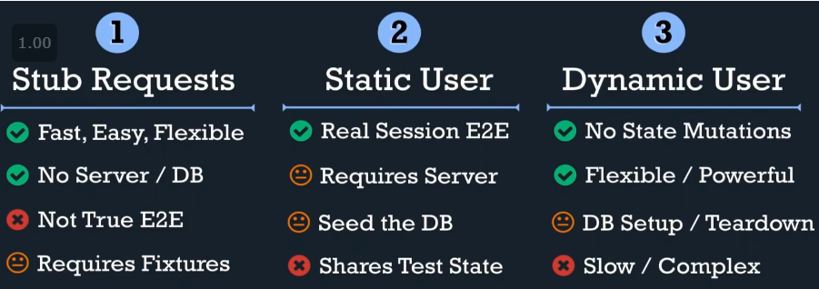

# Moodlog

## Getting Started

First, run the development server:

```bash
npm run dev
# or
yarn dev
```

Open [http://localhost:3000](http://localhost:3000) with your browser to see the result.

### Hot reloading

You can start editing pages by modifying `pages/index.js`. The page auto-updates as you edit the file.

### API routes

[API routes](https://nextjs.org/docs/api-routes/introduction) can be accessed on [http://localhost:3000/api/hello](http://localhost:3000/api/hello). This endpoint can be edited in `pages/api/hello.js`.

The `pages/api` directory is mapped to `/api/*`. Files in this directory are treated as [API routes](https://nextjs.org/docs/api-routes/introduction) instead of React pages.

### Testing

While running the development server (see commands above), run:

```bash
npm run test
# or
yarn test
```

## Documentation

- [Next.js Documentation](https://nextjs.org/docs) - learn about Next.js features and API.
- [Learn Next.js](https://nextjs.org/learn) - an interactive Next.js tutorial.
- [Cypress testing](https://cypress.io) - Testing tool used
- [NextAuth.js](https://next-auth.js.org/) - Authentication package used to login to keycloak
- [Tailwindcss](https://tailwindcss.com/docs) - Css utility framework (no more css files)
- [Tailwindui](https://tailwindui.com/) - Component examples build with Tailwind
- [React-icons](https://react-icons.github.io) - Library for inlining SVG of multiple SVG icons libs
- [Prisma](https://www.prisma.io) - ORM for typescript (with migrations :) )

## Known issues

- [Hot reload sometimes hangs](https://github.com/vercel/next.js/issues/10061) - Note that I fixed this by not using LTS Node but latest as of writing (15.13.0)

## Persistence

Prisma is used for storing data. Prisma is a ORM that I'm using with postgresql (again). It uses a schema for modeling your domain to your db, which is pretty nifty.

Change something in schema.prisma and typescript will automagicall be generated for you. To create a db migration and apply it:

```bash
npx prisma migrate dev
```

## Testing

Cypress is used for all testing, to keep the amount of test writing as low as possible.

### Best practices

Inspiration can be watched from [this youtube video](https://www.youtube.com/watch?v=5XQOK0v_YRE)

Short summary:

- Create test files based on (shared) components and pages
- Folder structure as follows:

```cli
articles\
    article_details.spec.ts
    article_new.spec.ts
    articles_list.spec.ts
shared\
    header_spec.ts
user\
    login.spec.ts
    register.spec.ts
    settings.spec.ts
```

- There are different types of authentication possible in Cypress. See image below



### Authentication in Cypress

Authentication command is inspired from [cypress-keycloak](https://github.com/babangsund/cypress-keycloak). ~~It is pretty slow though~~

## Deployment

As of now, there is no deployment or CI/CD yet. There are still some things that need to be done for this:

- [ ] Setup in Drone.io
- [ ] Create a command that resets database in testing
- [ ] Run the command from Cypress before each test
- [ ] Create a Dockerfile to run the application
- [ ] Add the application to the general docker-compose of my home server