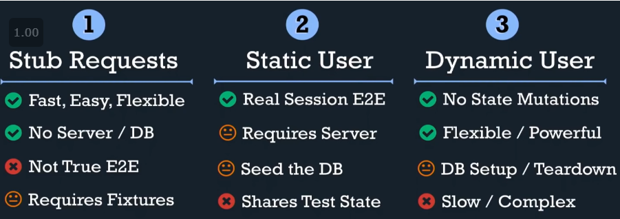

# Cypress notes

## Best practices

Inspiration can be watched from [this youtube video](https://www.youtube.com/watch?v=5XQOK0v_YRE)

Short summary:

- Create test files based on (shared) components and pages
- Create a folder structure as follows:

```cli
articles\
    article_details.spec.ts
    article_new.spec.ts
    articles_list.spec.ts
author\
    author_details_spec.ts
shared\
    header_spec.ts
user\
    login.spec.ts
    register.spec.ts
    settings.spec.ts
```

- 
